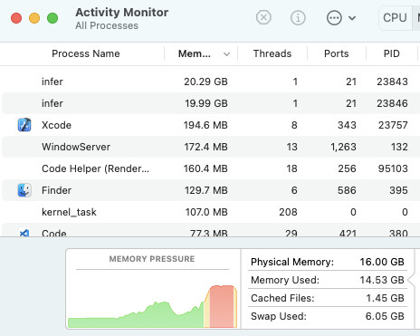
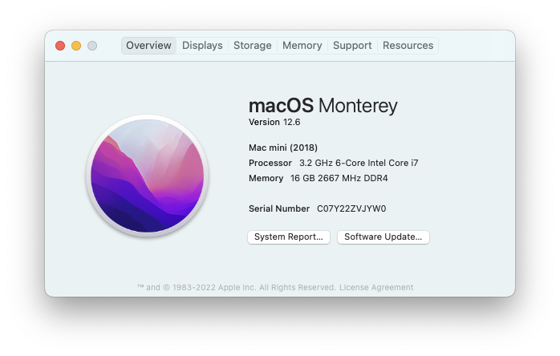

# FBInfer-MemoryLeak

The sample Objective-C code causes continuous memory increase - a memory leak - when using FBInfer run with xcodebuild



## Sample code

Used command

```shell
infer run -- xcodebuild clean build -project fbinfer-memoryleak.xcodeproj -scheme fbinfer-memoryleak -sdk iphonesimulator
```

The sample code is located in [Infer.m](./fbinfer-memoryleak/Infer.m)

```objectivec
#import <Foundation/Foundation.h>

@interface Builder: NSObject

@property (nonatomic, readonly) Builder * (^next)(void);

@end

@implementation Builder

- (Builder* (^)(void))next {
    return ^Builder * {
        NSLog(@"Do something");
        return self;
    };
}

@end

void infer(void) {
    Builder* builder = [[Builder alloc] init];
    builder
        .next()
        .next()
        .next()
        .next()
        .next()
        .next()
        .next()
        .next()
        .next()
        .next()
        .next()
        .next()
        .next()
        .next()
        .next();
}
```

The project uses an Objective-C class with block method style. The instance calls these methods chainingly, resulting in 15 chains. However, Infer capture by `xcodebuild` is stuck when compiling `Infer.m` which causing continuous memory increase (up to 20 GB and continuously increasing) until the device shuts down.

Using the `next` block with 14 chains consumes about 10GB of memory, while using 13 chains consumes about 5GB of memory. The program runs successfully without any memory issues.

## More Info

#### Infer

- Infer version v1.1.0-85a54ec3b7

#### Device



and


